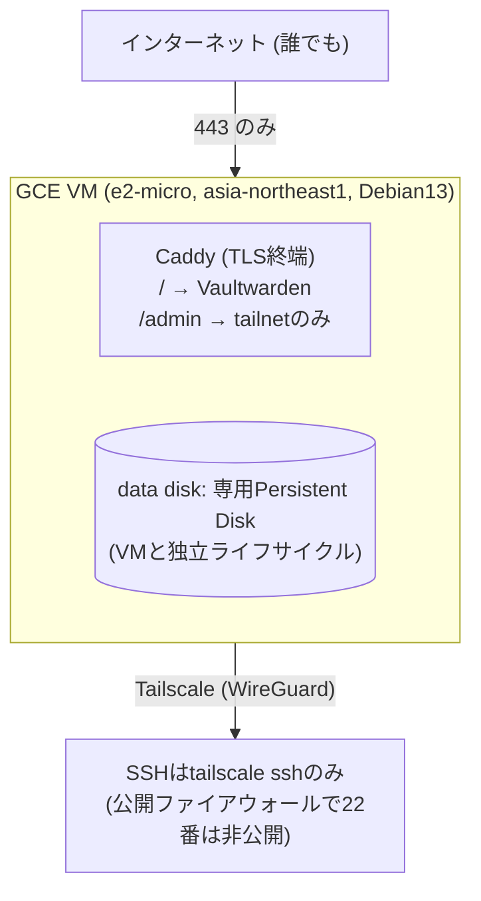

# vaultwarden-hosting

[English](README.md)

自分と家族用のVaultwarden(パスワードマネージャ)を、GCP Compute Engine(東京リージョン)上でセルフホスティングするためのインフラ一式。TerraformでGCPリソースを、GitHub ActionsでCI/CDを、Tailscaleで管理系アクセスを保護する。

- 公開URL: `https://vaultwarden.u-rei.com` (家族はここから普通にアクセス)
- SSH / Vaultwardenの`/admin`パネル: Tailscale tailnet経由のみ
- データバックアップ: 自宅Synology NASへ、Tailscale経由のrsyncデーモンで毎日プッシュ同期(下記参照)。世代管理はNAS側のBtrfsスナップショットに委譲
- 稼働監視・アラート: 別ホストで運用しているn8nのワークフロー(本リポジトリの管理外、手動構築)が`https://vaultwarden.u-rei.com/alive`を定期的にポーリングし、失敗時にVaultwarden専用のDiscordチャンネルへ通知する
- メール送信はBrevoのSMTPリレーを使用(招待メール・パスワードヒント・新規デバイス通知等)。マスターパスワードを完全に忘れた場合の保管庫復旧(Organization Account Recovery / Emergency Access)は別スコープ

## アーキテクチャ



Terraformは`terraform/bootstrap`(1回だけ手動apply)と`terraform/main`(GitHub Actionsが継続的にapply)の2段構成。

## セットアップ手順

### 0. 前提

- GCPプロジェクトが作成済みで、課金が有効化されていること
- ローカルに`gcloud` CLIと`terraform`(>=1.6)がインストール済みで、`gcloud auth application-default login`済みであること
- Tailscaleのtailnetに参加済みであること(このリポジトリではtailnetそのものは作成しない)

### 1. Bootstrap(手動・最初の1回だけ)

`terraform/main`はGCSのリモートバックエンドとWorkload Identity Federation経由のGitHub Actions認証を前提にしているが、そのバケットとWIF Pool自体は「これから作る側」なので、ローカルから一度だけ手動で作成する。`terraform/bootstrap`自身のstateも(`terraform/bootstrap/versions.tf`で設定した通り)ローカルファイルではなく同じバケット内の別prefix(`bootstrap`)に保管するため、最後にapplyしたマシンに依存せず、マシンを跨いでも紛失しない。

**このプロジェクトに既にstateバケットが存在する場合**(既にbootstrap済みの環境に対して、IAM変更の反映などで再度applyする一般的なケース):

```bash
cd terraform/bootstrap
terraform init -backend-config="bucket=<既存のstateバケット名>"
terraform apply \
  -var="project_id=<your-gcp-project-id>" \
  -var="github_repo=<your-github-username>/<your-repo-name>"  # must exactly match the GitHub repo, e.g. kuchida1981/vaultwarden-ops
```

**真にゼロから新規GCPプロジェクトで初めてbootstrapを実行する場合**(バケットがまだ存在せず、`terraform init`がbackendの向き先を持てない)は、代わりに一度きりの「ローカル実行→migrate」手順を踏む:

```bash
cd terraform/bootstrap

# 1. versions.tf の `backend "gcs" { ... }` ブロックを一時的にコメントアウトし、
#    この最初の1回だけローカルstateでバケット自体を作成する。
terraform init
terraform apply \
  -var="project_id=<your-gcp-project-id>" \
  -var="github_repo=<your-github-username>/<your-repo-name>"

# 2. `backend "gcs" { ... }` ブロックを元に戻し、直前のapplyが作成した
#    バケットへ、そのstateを移行する。
terraform init -backend-config="bucket=$(terraform output -raw state_bucket)" -migrate-state
```

いずれの手順でも、apply完了後は以下のoutputを控える(次のGitHub Secrets登録で使う):

```bash
terraform output
# state_bucket
# workload_identity_provider
# terraform_ci_service_account_email
```

**既存環境をアップデートする場合**: `terraform/bootstrap`はGitHub Actionsではなく手動apply専用のため、CI用サービスアカウントのIAM権限が変更されたときは、同じ`terraform apply`コマンドを再実行して反映させる必要がある。差分のみが適用され、既存リソースは壊れない。stateはGCS上にあるため、どのマシンからでも`terraform init -backend-config="bucket=<state_bucket>"`でstateに再接続すればよく、最後にapplyしたマシンである必要はない。

**planは自動化されているが、applyはされていない**: `.github/workflows/terraform-plan.yml`は、すべてのPR(dependabotによる週次providerバージョンアップPRを含む)に対して`terraform/bootstrap`への`terraform plan`を実行し、結果をコメントする。`terraform/main`と同じ読み取り権限を持つCI用サービスアカウントを使う。一方`terraform-apply.yml`は**意図的に`terraform/bootstrap`を対象外にしている**: このディレクトリはCI用サービスアカウント自身・そのWorkload Identity Federation Pool・そのSA自身へのproject IAMバインディングを作成する構成であり、CIがこれをapplyできると、そのIDが自分自身により広い権限を無監督で付与できてしまうため。CIが投稿したplanをレビューした上で、上記の通り手動で`terraform apply`することが、`terraform/bootstrap`への変更を反映する唯一の方法であることに変わりはない。

### 2. Tailscale OAuthクライアントの発行(手動)

`terraform/main`の`tailscale`プロバイダがACLと認証キーをコード管理するために、tailnetへのAPIアクセス権を持つOAuthクライアントが必要。

1. **先にタグを定義する**: https://login.tailscale.com/admin/acl/file を開き、`tagOwners`に以下を追記して保存する(`Auth Keys`スコープはタグ制限が必須で、そのタグがACLに未定義だと選択できない)

   ```json
   "tagOwners": {
       "tag:vaultwarden-server": ["autogroup:admin"],
   },
   ```

   (このエントリは`terraform/main/tailscale.tf`の`tailscale_acl`リソースが後で適用する内容と同一なので、後続のTerraform applyと矛盾しない)

2. https://login.tailscale.com/admin/settings/oauth を開く
3. "Generate OAuth client" を実行
4. スコープに **Policy File** (write) と **Auth Keys** (write) を付与(APIスコープ名としては`policy_file`と`auth_keys`。`tailscale_acl`リソースがPolicy File、`tailscale_tailnet_key`リソースがAuth Keysを使う)。Auth Keysのタグには手順1で定義した `tag:vaultwarden-server` を選択する
5. 発行された **Client ID** と **Client Secret** を控える(Secretは一度しか表示されない)
6. https://login.tailscale.com/admin/dns で **HTTPS Certificates** を有効化する(tailnet単位の設定で、Terraformプロバイダでは管理できない)。これによりVM上の`tailscale serve`(手順9で`/admin`パネルをtailnet限定公開するのに使う)がTLS証明書を自動取得・更新できるようになる

### 3. BrevoでSMTPリレーを設定(手動)

VaultwardenからのメールはBrevoのSMTPリレー経由で送信する。

1. https://app.brevo.com でアカウントを作成し、送信元に使うドメイン(このリポジトリでは`u-rei.com`)を登録してドメイン認証を行う。案内されるDKIM(CNAMEレコード)・DMARC(TXTレコード)をドメインのDNSに追加する(SPFはBrevoがEnvelope Fromに自社ドメインを使うため追加不要)
2. 送信専用アドレス(例: `vaultwarden@u-rei.com`)をBrevoの「Senders」に登録する
3. 「SMTP & API」→「SMTP」タブで新しいSMTPキーを発行する。表示されるSMTPログインとあわせて控える(アカウントのログインメール/パスワードとは別物)
4. 控えた値は次のGitHub Secrets登録で使う

### 4. NASへの定期バックアップ用Rsyncサーバーの設定(手動)

VMは毎日、Synology NASへVaultwardenのデータ(DBの一貫性スナップショット・添付ファイル・Send・署名鍵・設定ファイル)をrsyncデーモン経由でプッシュ同期する。認証はSSH鍵ではなくrsyncd自体のパスワードのみで、通信はTailscaleのWireGuardトンネル内に閉じるため、この単純さは許容している(詳細は`openspec/changes/add-nas-backup/design.md`参照)。

1. NASがVMと同じTailscale tailnetに参加していることを確認する(`tailscale ping <NASのホスト名>`で疎通確認)
2. NASのコントロールパネル→ファイルサービス→rsyncで「Rsyncサーバー」を有効化する
3. バックアップ受け入れ用の共有フォルダを新規作成する(Btrfs上のボリュームであること。Synologyのrsyncサーバーは共有フォルダ名がそのままrsyncのモジュール名になる)
4. バックアップ専用アカウントを作成し、手順3の共有フォルダへの読み書き権限のみを付与する(rsync以外のサービスへのアクセスは不要)。発行したパスワードを控える
5. 手順3の共有フォルダにスナップショットスケジュールを設定する。「保持」タブのSmart Retentionルールで、毎日7・毎週4・毎月3を目安に設定する(1日1回しかバックアップしないため「毎時」の枠は実質使われない)。「スケジュール」タブでは、VM側のバックアップ実行時刻(後述、03:00 JST頃)より後、余裕を持って1日1回(例: 04:30 JST)に設定する
6. 控えたホスト名・共有フォルダ名(モジュール名)・アカウント名は、それぞれ`terraform/main/variables.tf`の`nas_backup_host`/`nas_backup_module`/`nas_backup_username`のデフォルト値と一致させるか、`-var`で上書きする。パスワードは次のGitHub Secrets登録で使う

### 5. GitHub Actions Secretsの登録

このリポジトリの Settings → Secrets and variables → Actions に、以下を登録する:

| Secret名 | 値 |
|---|---|
| `GCP_PROJECT_ID` | GCPプロジェクトID |
| `GCP_WORKLOAD_IDENTITY_PROVIDER` | bootstrapのoutput `workload_identity_provider` |
| `GCP_SERVICE_ACCOUNT_EMAIL` | bootstrapのoutput `terraform_ci_service_account_email` |
| `TF_STATE_BUCKET` | bootstrapのoutput `state_bucket` |
| `TAILSCALE_OAUTH_CLIENT_ID` | 手順2で発行したClient ID |
| `TAILSCALE_OAUTH_CLIENT_SECRET` | 手順2で発行したClient Secret |
| `TAILSCALE_TAILNET` | 自分のtailnet名(例: `example.ts.net`のexample部分、またはメールアドレス形式) |
| `BREVO_SMTP_USERNAME` | BrevoのSMTP & API画面で発行したSMTPログイン |
| `BREVO_SMTP_PASSWORD` | Brevoで発行したSMTPキー(アカウントログインパスワードとは別物) |
| `NAS_BACKUP_PASSWORD` | 手順4で発行したNASのrsyncdバックアップアカウントのパスワード |

**重要**: これらはリポジトリにコミットしない。すべてGitHub Actions Secretsとしてのみ保持する(このリポジトリは公開リポジトリなので特に注意)。

### 6. GitHub Environmentの承認ゲート設定(手動)

`terraform-apply.yml`ワークフローは`environment: production`を参照しているが、実際に人間の承認待ちで停止させるprotection ruleはワークフローYAMLだけでは設定できない。このリポジトリの Settings → Environments → New environment で `production` を作成し、"Required reviewers" に自分自身(または信頼できるレビュワー)を追加する。

### 7. Terraform mainのapply

`main`ブランチへのマージ後、GitHub Actionsの`terraform apply`ワークフローが承認待ちで停止するので、GitHub上で承認する。初回applyでVM・静的IP・ファイアウォール・データディスク・Secret Manager・Tailscale ACL/認証キーが一括作成される。

**注意**: `tailscale_acl`リソースはtailnetのACLポリシー全体を1つのリソースとして管理する。初回apply前に https://login.tailscale.com/admin/acl/file で現在のACL設定を確認し、既存のカスタムルール(あれば)を`terraform/main/tailscale.tf`にマージしてから実行すること。

### 8. DNSレコードの手動作成

`u-rei.com`はレジストラのデフォルトDNSで管理しており、Terraformでは自動化していない。apply完了後、以下の出力値を使って手動でAレコードを作成する:

```bash
cd terraform/main
terraform output vm_external_ip
```

`u-rei.com`のDNS管理画面で `vaultwarden` サブドメインのAレコードをこのIPに向けて作成する。

### 9. adminパネルへのアクセス経路(自分の端末のみ)

`/admin`は公開ドメイン経由では到達できない(`https://vaultwarden.u-rei.com/admin`は送信元IPによらず常に403を返す)。代わりにVMが`tailscale serve`で`/admin`をtailnetへ直接公開しており、tailnetに参加済みの端末であれば`hosts`ファイル編集などの追加設定なしに、以下のMagicDNSホスト名で自動的に到達できる:

```
https://vaultwarden.<自分のtailnet名>.ts.net/admin
```

(`<自分のtailnet名>`は`TAILSCALE_TAILNET` Secretと同じ値。例: `example.ts.net`のexample部分)。これはtailnetに実際に参加している端末からのみ機能する。証明書が発行されるには、前述の手順6を先に完了させておく必要がある。

### 10. 動作確認と家族の招待

- `https://vaultwarden.u-rei.com` にアクセスし、Let's Encrypt証明書が有効になっていることを確認
- `tailscale ssh <vm-hostname>` でVMに接続できることを確認
- `https://vaultwarden.u-rei.com/admin`がtailnetの内外どちらからアクセスしても403になることを確認
- 自分のtailnet参加端末から`https://vaultwarden.<自分のtailnet名>.ts.net/admin`にアクセスできること、tailnet未参加の端末からは到達できないことを確認
- `/admin`から家族分のメールアドレスを入力して招待する。SMTP設定済みのため招待メールが自動送信される(迷惑フォルダも確認する)
- VM上で`systemctl start backup.service`を実行し、NAS側の共有フォルダにバックアップが転送されることを確認する

## NASバックアップからのリストア手順

> **注意**: この手順はdesign.md記載の設計に基づく下書きであり、実機での通し検証はまだ行っていない(`openspec/changes/add-nas-backup/tasks.md`のセクション7を参照)。実際にリストアが必要になる前に、一度この手順通りに検証しておくことを強く推奨する。

1. NASのBtrfsスナップショット一覧(DSMスナップショットマネージャ、または共有フォルダの`@GMT-<timestamp>`隠しディレクトリ)から復元したい世代を選ぶ
2. VM上でVaultwardenを停止する: `docker compose -f /opt/vaultwarden/app/vaultwarden/docker-compose.yml --env-file /opt/vaultwarden/.env stop vaultwarden`(リストアは非常時作業のため、通常運用時と異なりここでは無停止化にこだわらない)
3. 現行データを退避する: `mv /opt/vaultwarden/data /opt/vaultwarden/data.bak.$(date +%s)`(誤操作時の戻し先を確保)
4. 選んだNASスナップショット世代から`/opt/vaultwarden/data`へrsyncまたはコピーする。この際、バックアップ時に`sqlite3 .backup`で作成した一貫性コピーを本来のファイル名`db.sqlite3`として配置し、古い`-wal`/`-shm`断片は復元先に含めない(Vaultwarden起動時に新規生成させる)
5. 復元後のファイル所有者・パーミッションがコンテナ実行ユーザーと一致することを確認する(rootが所有していると読み取れない事故になりうる)
6. `docker compose up -d`でVaultwardenを起動し、ログイン成功・既存添付ファイルが開けること・`/admin`のユーザー一覧が正しいことを確認する
7. 問題なければ手順3で退避した`data.bak.*`を削除する

## ロードマップ(本リポジトリの現時点のスコープ外)

- 保管庫の復旧手段(Organization Account Recovery / Emergency Access)。マスターパスワードを完全に忘れた場合、ゼロ知識暗号化のためSMTPだけでは救済できない

## ディレクトリ構成

```
terraform/bootstrap/  … 手動・1回だけapply。GCS state bucket, WIF Pool, CI用SA
terraform/main/       … GitHub Actionsが継続的にapply。VM/FW/Disk/Secret Manager/Tailscale ACL
vaultwarden/           … docker-compose.yml, Caddyfile
.github/workflows/     … terraform plan(PR) / apply(main, 承認ゲート付き)
```
