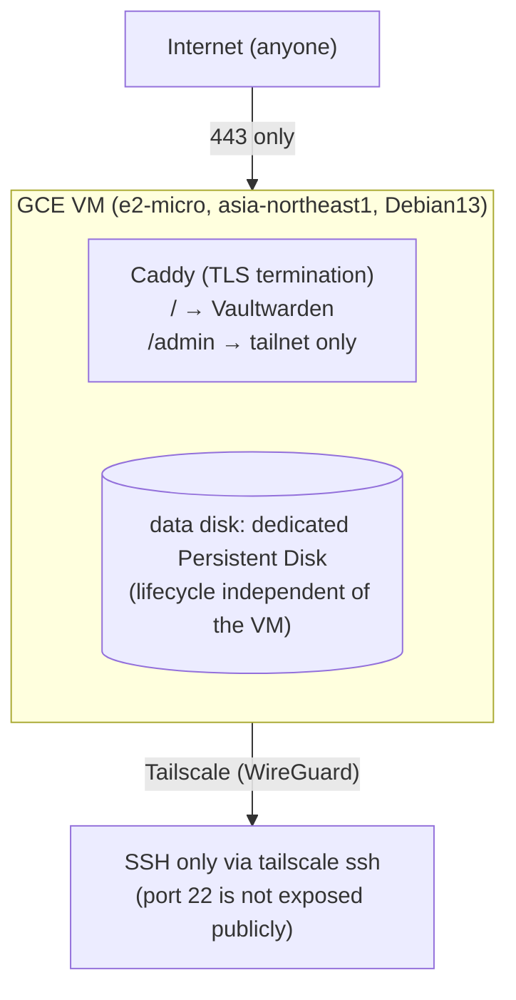

# vaultwarden-hosting

[日本語](README.ja.md)

A complete infrastructure setup for self-hosting Vaultwarden (a password manager) for me and my family on GCP Compute Engine (Tokyo region). Terraform manages GCP resources, GitHub Actions handles CI/CD, and Tailscale protects administrative access.

- Public URL: `https://vaultwarden.u-rei.com` (family members access it normally from here)
- SSH / Vaultwarden's `/admin` panel: only reachable via the Tailscale tailnet
- Data backup: pushed daily to a home Synology NAS via an rsync daemon over Tailscale (see below). Generation management is delegated to Btrfs snapshots on the NAS side
- Uptime monitoring / alerting: an n8n workflow running on a separate host (not managed by this repository, built manually) periodically polls `https://vaultwarden.u-rei.com/alive` and notifies a dedicated Vaultwarden Discord channel on failure
- Outbound email uses Brevo's SMTP relay (invitation emails, password hints, new device notifications, etc.). Vault recovery when the master password is completely forgotten (Organization Account Recovery / Emergency Access) is out of scope

## Architecture



Terraform is split into two stages: `terraform/bootstrap` (applied manually, once) and `terraform/main` (applied continuously by GitHub Actions).

## Setup

### 0. Prerequisites

- A GCP project already created, with billing enabled
- `gcloud` CLI and `terraform` (>=1.6) installed locally, and `gcloud auth application-default login` already done
- Already joined a Tailscale tailnet (this repository does not create the tailnet itself)

### 1. Bootstrap (manual, once)

`terraform/main` assumes a GCS remote backend and GitHub Actions authentication via Workload Identity Federation, but the bucket and WIF Pool themselves are what's "about to be created," so they're set up manually from your local machine, once. `terraform/bootstrap` itself also keeps its own state in that same bucket (under a separate `bootstrap` prefix, configured in `terraform/bootstrap/versions.tf`), rather than a local file, so its state isn't tied to whichever machine last ran `apply` and isn't at risk of being lost when you switch machines.

**If the state bucket already exists in this project** (the common case — re-running bootstrap on an already-bootstrapped environment, e.g. to pick up an IAM change):

```bash
cd terraform/bootstrap
terraform init -backend-config="bucket=<existing-state-bucket-name>"
terraform apply \
  -var="project_id=<your-gcp-project-id>" \
  -var="github_repo=<your-github-username>/<your-repo-name>"  # must exactly match the GitHub repo, e.g. kuchida1981/vaultwarden-ops
```

**If this is the very first bootstrap run in a brand new GCP project** (the bucket doesn't exist yet, so `terraform init` has nothing to point the backend at), do a one-time local-then-migrate dance instead:

```bash
cd terraform/bootstrap

# 1. Temporarily comment out the `backend "gcs" { ... }` block in versions.tf
#    so this first-ever run can use local state to create the bucket itself.
terraform init
terraform apply \
  -var="project_id=<your-gcp-project-id>" \
  -var="github_repo=<your-github-username>/<your-repo-name>"

# 2. Restore the `backend "gcs" { ... }` block, then migrate the state you
#    just created into the bucket that same apply just created.
terraform init -backend-config="bucket=$(terraform output -raw state_bucket)" -migrate-state
```

After either path, note the following outputs (you'll need them when registering GitHub Secrets):

```bash
terraform output
# state_bucket
# workload_identity_provider
# terraform_ci_service_account_email
```

**Updating an existing environment**: Since `terraform/bootstrap` is manual-apply-only (not run by GitHub Actions), if the CI service account's IAM permissions ever change, you need to re-run the same `terraform apply` command to pick up the change. Only the diff is applied; existing resources are untouched. Because state now lives in GCS, this can be done from any machine — just run `terraform init -backend-config="bucket=<state_bucket>"` first to reconnect to the shared state; there's no need to be on the machine that last applied it.

### 2. Issue a Tailscale OAuth client (manual)

For `terraform/main`'s `tailscale` provider to manage the ACL and auth keys as code, an OAuth client with API access to the tailnet is required.

1. **Define the tag first**: open https://login.tailscale.com/admin/acl/file and add the following to `tagOwners`, then save (the `Auth Keys` scope requires tag restriction, and you can't select a tag that isn't yet defined in the ACL)

   ```json
   "tagOwners": {
       "tag:vaultwarden-server": ["autogroup:admin"],
   },
   ```

   (This entry is identical to what the `tailscale_acl` resource in `terraform/main/tailscale.tf` will apply later, so it won't conflict with the subsequent Terraform apply.)

2. Open https://login.tailscale.com/admin/settings/oauth
3. Run "Generate OAuth client"
4. Grant the **Policy File** (write) and **Auth Keys** (write) scopes (the API scope names are `policy_file` and `auth_keys`; the `tailscale_acl` resource uses Policy File, and the `tailscale_tailnet_key` resource uses Auth Keys). For the Auth Keys tag, select the `tag:vaultwarden-server` tag defined in step 1
5. Note down the issued **Client ID** and **Client Secret** (the secret is shown only once)
6. Enable **HTTPS Certificates** at https://login.tailscale.com/admin/dns (tailnet-wide setting, not something the Terraform provider can manage). This lets the VM's `tailscale serve` (used to publish the `/admin` panel to the tailnet only - see step 9) obtain and renew a TLS certificate automatically

### 3. Configure the Brevo SMTP relay (manual)

Emails from Vaultwarden are sent via Brevo's SMTP relay.

1. Create an account at https://app.brevo.com, register the domain you'll send from (`u-rei.com` in this repository), and complete domain authentication. Add the DKIM (CNAME record) and DMARC (TXT record) entries it provides to your domain's DNS (SPF is not needed since Brevo uses its own domain in the Envelope From)
2. Register a send-only address (e.g. `vaultwarden@u-rei.com`) under Brevo's "Senders"
3. Under "SMTP & API" → "SMTP" tab, issue a new SMTP key. Note it down along with the SMTP login shown (this is separate from your account login email/password)
4. You'll need these values for the GitHub Secrets setup below

### 4. Set up the rsync server on the NAS for periodic backups (manual)

Every day, the VM push-syncs Vaultwarden's data (a consistent DB snapshot, attachments, Send, signing keys, config files) to the Synology NAS via an rsync daemon. Authentication uses only the rsyncd password itself rather than SSH keys, and since the traffic stays within the Tailscale WireGuard tunnel, this level of simplicity is considered acceptable (see `openspec/changes/add-nas-backup/design.md` for details).

1. Confirm the NAS is on the same Tailscale tailnet as the VM (verify connectivity with `tailscale ping <NAS-hostname>`)
2. On the NAS control panel, go to File Services → rsync and enable "Rsync Server"
3. Create a new shared folder to receive backups (must be a volume on Btrfs; Synology's rsync server uses the shared folder name directly as the rsync module name)
4. Create a dedicated backup account and grant it read/write access to only the shared folder from step 3 (no access to other services is needed). Note down the issued password
5. Set up a snapshot schedule on the shared folder from step 3. Under the "Retention" tab, configure Smart Retention rules aiming for roughly 7 daily, 4 weekly, and 3 monthly snapshots (since backups only run once a day, the "hourly" slot is effectively unused). Under the "Schedule" tab, set it to run once a day (e.g. 04:30 JST) with enough margin after the VM-side backup run time (around 03:00 JST, described below)
6. Make the noted hostname, shared folder name (module name), and account name match the default values of `nas_backup_host`/`nas_backup_module`/`nas_backup_username` in `terraform/main/variables.tf`, or override them with `-var`. You'll need the password for the GitHub Secrets setup below

### 5. Register GitHub Actions Secrets

Register the following under this repository's Settings → Secrets and variables → Actions:

| Secret name | Value |
|---|---|
| `GCP_PROJECT_ID` | GCP project ID |
| `GCP_WORKLOAD_IDENTITY_PROVIDER` | bootstrap output `workload_identity_provider` |
| `GCP_SERVICE_ACCOUNT_EMAIL` | bootstrap output `terraform_ci_service_account_email` |
| `TF_STATE_BUCKET` | bootstrap output `state_bucket` |
| `TAILSCALE_OAUTH_CLIENT_ID` | Client ID issued in step 2 |
| `TAILSCALE_OAUTH_CLIENT_SECRET` | Client Secret issued in step 2 |
| `TAILSCALE_TAILNET` | your tailnet name (e.g. the `example` part of `example.ts.net`, or an email-address form) |
| `BREVO_SMTP_USERNAME` | SMTP login issued in Brevo's SMTP & API screen |
| `BREVO_SMTP_PASSWORD` | SMTP key issued by Brevo (separate from the account login password) |
| `NAS_BACKUP_PASSWORD` | password for the NAS rsyncd backup account issued in step 4 |

**Important**: Never commit these to the repository. Keep them only as GitHub Actions Secrets (this repository is public, so be especially careful).

### 6. Configure the GitHub Environment approval gate (manual)

The `terraform-apply.yml` workflow references `environment: production`, but the protection rule that actually pauses it for human approval cannot be set via workflow YAML alone. Under this repository's Settings → Environments → New environment, create `production` and add yourself (or a trusted reviewer) as a "Required reviewer".

### 7. Apply terraform/main

After merging to `main`, the GitHub Actions `terraform apply` workflow will pause waiting for approval; approve it on GitHub. The first apply creates the VM, static IP, firewall rules, data disk, Secret Manager, and Tailscale ACL/auth keys all at once.

**Note**: the `tailscale_acl` resource manages the entire tailnet ACL policy as a single resource. Before the first apply, check the current ACL settings at https://login.tailscale.com/admin/acl/file and merge any existing custom rules into `terraform/main/tailscale.tf` before running it.

### 8. Create the DNS record manually

`u-rei.com` is managed under the registrar's default DNS and is not automated via Terraform. After the apply completes, use the following output value to manually create an A record:

```bash
cd terraform/main
terraform output vm_external_ip
```

In `u-rei.com`'s DNS management screen, create an A record for the `vaultwarden` subdomain pointing to this IP.

### 9. Access path to the admin panel (your device only)

`/admin` is never reachable through the public domain (`https://vaultwarden.u-rei.com/admin` always returns 403, regardless of source IP). Instead, the VM publishes it directly to the tailnet via `tailscale serve`, at a MagicDNS hostname that any device already joined to the tailnet can resolve automatically - no `hosts` file editing or DNS configuration needed:

```
https://vaultwarden.<your-tailnet-name>.ts.net/admin
```

(`<your-tailnet-name>` is the same value as the `TAILSCALE_TAILNET` secret, e.g. the `example` part of `example.ts.net`.) This only works from devices actually joined to the tailnet; step 6 above must be completed first for the certificate to be issued.

### 10. Verify operation and invite family members

- Access `https://vaultwarden.u-rei.com` and confirm the Let's Encrypt certificate is valid
- Confirm you can connect to the VM with `tailscale ssh <vm-hostname>`
- Confirm that accessing `https://vaultwarden.u-rei.com/admin` returns 403, from both inside and outside the tailnet
- Confirm you can access `https://vaultwarden.<your-tailnet-name>.ts.net/admin` from your own tailnet-joined device, and that it's unreachable from a device not joined to the tailnet
- Invite family members by entering their email addresses from `/admin`. Since SMTP is configured, invitation emails are sent automatically (also check the spam folder)
- On the VM, run `systemctl start backup.service` and confirm the backup is transferred to the shared folder on the NAS

## Restore procedure from NAS backup

> **Note**: this procedure is a draft based on the design described in design.md, and has not yet been fully verified end-to-end on real hardware (see section 7 of `openspec/changes/add-nas-backup/tasks.md`). It's strongly recommended to verify this procedure once before an actual restore is ever needed.

1. Choose the generation to restore from the NAS's list of Btrfs snapshots (DSM Snapshot Manager, or the hidden `@GMT-<timestamp>` directory in the shared folder)
2. Stop Vaultwarden on the VM: `docker compose -f /opt/vaultwarden/app/vaultwarden/docker-compose.yml --env-file /opt/vaultwarden/.env stop vaultwarden` (since a restore is an emergency operation, zero-downtime is not a concern here, unlike normal operations)
3. Move aside the current data: `mv /opt/vaultwarden/data /opt/vaultwarden/data.bak.$(date +%s)` (to have a fallback in case of mistakes)
4. Rsync or copy from the chosen NAS snapshot generation into `/opt/vaultwarden/data`. When doing so, place the consistent copy created via `sqlite3 .backup` at backup time under the original filename `db.sqlite3`, and do not include the old `-wal`/`-shm` fragments in the restored data (let Vaultwarden regenerate them on startup)
5. Confirm that the restored files' ownership and permissions match the container's runtime user (files owned by root can become unreadable, which would be problematic)
6. Start Vaultwarden with `docker compose up -d` and confirm successful login, that existing attachments open, and that the user list under `/admin` is correct
7. If everything looks fine, delete the `data.bak.*` moved aside in step 3

## Roadmap (currently out of scope for this repository)

- Vault recovery method (Organization Account Recovery / Emergency Access). If the master password is completely forgotten, zero-knowledge encryption means SMTP alone cannot help

## Directory structure

```
terraform/bootstrap/  … manual, applied once. GCS state bucket, WIF Pool, CI service account
terraform/main/       … applied continuously by GitHub Actions. VM/firewall/disk/Secret Manager/Tailscale ACL
vaultwarden/           … docker-compose.yml, Caddyfile
.github/workflows/     … terraform plan (PR) / apply (main, with approval gate)
```
